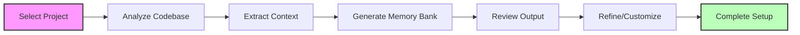
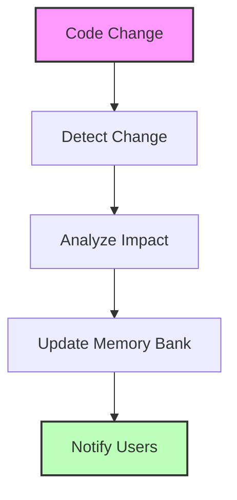
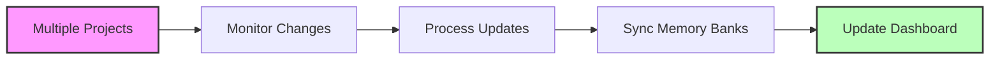
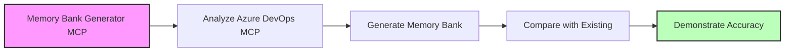

# Product Requirements Document (PRD)
# Memory Bank Generator MCP Server
*2025 Microsoft Hackathon Project*

---

## Executive Summary

### Vision
Create an intelligent MCP server that automatically generates, maintains, and evolves memory bank files for any software project, enabling AI assistants to have persistent, structured knowledge about codebases.

### Value Proposition
- **For Developers**: Automatic documentation and knowledge capture without manual effort
- **For AI Assistants**: Rich contextual understanding of projects for better assistance
- **For Teams**: Shared knowledge base that grows with the project

---

## Problem Statement

### Current Pain Points
1. **Manual Documentation Burden**: Developers spend significant time writing and maintaining project documentation
2. **Context Loss**: AI assistants lack persistent memory about project evolution, decisions, and patterns
3. **Knowledge Silos**: Project knowledge exists in scattered locations (code comments, commit messages, conversations)
4. **Inconsistent Documentation**: Different projects have varying documentation quality and structure

### Market Opportunity
- Growing adoption of AI-powered development tools
- Increasing need for automated documentation solutions
- Rising complexity of software projects requiring better knowledge management
- Microsoft's investment in AI-assisted development (GitHub Copilot, etc.)

---

## Solution Overview

### Core Concept
A specialized MCP server that analyzes codebases and automatically generates comprehensive memory bank files, similar to your Azure DevOps MCP server's memory-bank structure, but focused on any software project.

### Key Capabilities
1. **Automatic Memory Bank Generation**: Scan projects and create structured memory files
2. **Continuous Evolution**: Update memory banks as projects change
3. **Multi-Project Support**: Manage memory banks for multiple projects simultaneously
4. **Intelligent Categorization**: Automatically organize information into appropriate memory categories
5. **Integration Hub**: Connect with various development tools and platforms

---

## Target Users

### Primary Users
1. **Solo Developers**: Individual developers working on personal or small projects
2. **Development Teams**: Small to medium teams needing shared project knowledge
3. **Open Source Maintainers**: Project maintainers wanting better documentation automation

### Secondary Users
1. **AI Assistant Providers**: Companies building AI development tools
2. **Enterprise Development Teams**: Large organizations with complex codebases
3. **Educational Institutions**: Teaching code comprehension and documentation

---

## Core Features

### 1. Memory Bank Generation Engine
**Priority**: Critical
**Description**: Core engine that analyzes projects and generates memory bank files

#### Capabilities:
- **Project Analysis**: Scan file structure, dependencies, code patterns
- **Context Extraction**: Extract meaningful information from code, comments, commit history
- **Template-Based Generation**: Use predefined templates for different project types
- **Incremental Updates**: Track changes and update memory banks accordingly

#### Technical Implementation:
```typescript
// Memory Bank Generator Tools
const tools = [
  "analyze_project",           // Scan project structure and dependencies
  "generate_memory_bank",      // Create initial memory bank files
  "update_memory_bank",        // Update existing memory banks
  "extract_context",           // Extract context from various sources
  "categorize_information",    // Organize information into categories
  "validate_memory_bank"       // Ensure quality and completeness
];
```

### 2. Multi-Source Intelligence
**Priority**: High
**Description**: Gather information from multiple sources to build comprehensive knowledge

#### Sources:
- **Code Analysis**: AST parsing, dependency analysis, pattern detection
- **Git History**: Commit messages, branch patterns, contributor analysis
- **Documentation**: README files, code comments, documentation sites
- **Project Metadata**: Package.json, requirements.txt, configuration files
- **Issue Tracking**: GitHub Issues, Azure DevOps work items (via other MCP servers)

### 3. Smart Categorization System
**Priority**: High
**Description**: Automatically organize information into structured categories

#### Memory Bank Categories:
1. **Project Context** (`projectContext.md`)
   - Purpose and goals
   - Problem being solved
   - Solution overview
   - Target users

2. **Technical Context** (`techContext.md`)
   - Technology stack
   - Architecture patterns
   - Dependencies
   - Build/deployment process

3. **Active Context** (`activeContext.md`)
   - Current development focus
   - Recent changes
   - Active decisions
   - Implementation status

4. **System Patterns** (`systemPatterns.md`)
   - Code patterns
   - Communication flows
   - Best practices
   - Evolution patterns

5. **Progress Tracking** (`progress.md`)
   - Development timeline
   - Feature status
   - Known issues
   - Future roadmap

### 4. Continuous Evolution Engine
**Priority**: Medium
**Description**: Keep memory banks current as projects evolve

#### Features:
- **Change Detection**: Monitor file changes, commits, and project updates
- **Intelligent Updates**: Update relevant memory bank sections based on changes
- **Version Tracking**: Maintain history of memory bank evolution
- **Conflict Resolution**: Handle conflicting information intelligently

### 5. Integration Framework
**Priority**: Medium
**Description**: Connect with other MCP servers and development tools

#### Integrations:
- **GitHub MCP Server**: Pull repository information, issues, pull requests
- **Azure DevOps MCP Server**: Work items, repositories, project data
- **File System MCP Server**: Monitor local file changes
- **Custom Integrations**: Plugin system for additional tools

---

## Technical Architecture

### Core Components

#### 1. Analysis Engine
```typescript
interface AnalysisEngine {
  scanProject(projectPath: string): ProjectStructure;
  extractContext(sources: ContextSource[]): ProjectContext;
  identifyPatterns(codebase: Codebase): SystemPatterns;
  trackProgress(history: GitHistory): ProgressData;
}
```

#### 2. Memory Bank Generator
```typescript
interface MemoryBankGenerator {
  generateMemoryBank(project: ProjectAnalysis): MemoryBank;
  updateMemoryBank(existing: MemoryBank, changes: ProjectChanges): MemoryBank;
  validateMemoryBank(memoryBank: MemoryBank): ValidationResult;
}
```

#### 3. Integration Manager
```typescript
interface IntegrationManager {
  connectToMCPServer(serverConfig: MCPServerConfig): MCPConnection;
  syncWithExternalSources(sources: ExternalSource[]): SyncResult;
  notifyChanges(changes: MemoryBankChanges): void;
}
```

### MCP Tools

#### Primary Tools
```typescript
const mcpTools = [
  // Project Analysis
  {
    name: "analyze_project",
    description: "Analyze a project structure and extract key information",
    inputSchema: {
      type: "object",
      properties: {
        projectPath: { type: "string" },
        analysisDepth: { type: "string", enum: ["basic", "detailed", "comprehensive"] },
        includeHistory: { type: "boolean" }
      }
    }
  },
  
  // Memory Bank Generation
  {
    name: "generate_memory_bank",
    description: "Generate complete memory bank files for a project",
    inputSchema: {
      type: "object",
      properties: {
        projectPath: { type: "string" },
        outputPath: { type: "string" },
        template: { type: "string" },
        categories: { type: "array", items: { type: "string" } }
      }
    }
  },
  
  // Continuous Updates
  {
    name: "update_memory_bank",
    description: "Update existing memory bank with new information",
    inputSchema: {
      type: "object",
      properties: {
        memoryBankPath: { type: "string" },
        changes: { type: "object" },
        updateStrategy: { type: "string", enum: ["merge", "replace", "append"] }
      }
    }
  },
  
  // Multi-Source Integration
  {
    name: "extract_from_source",
    description: "Extract information from external sources",
    inputSchema: {
      type: "object",
      properties: {
        sourceType: { type: "string", enum: ["git", "github", "azure-devops", "documentation"] },
        sourceConfig: { type: "object" },
        extractionRules: { type: "array" }
      }
    }
  }
];
```

### Technology Stack

#### Core Technologies
- **Node.js v18+**: Runtime environment
- **TypeScript 5.x**: Type-safe development
- **MCP SDK**: Protocol implementation
- **Tree-sitter**: Code parsing and analysis
- **Simple-git**: Git repository analysis

#### Analysis Libraries
- **@babel/parser**: JavaScript/TypeScript AST parsing
- **dependency-tree**: Dependency analysis
- **glob**: File pattern matching
- **gray-matter**: Frontmatter parsing
- **marked**: Markdown processing

#### Integration Libraries
- **axios**: HTTP client for API calls
- **ws**: WebSocket communication
- **chokidar**: File system watching
- **dotenv**: Environment configuration

---

## User Experience Design

### Primary Workflows

#### 1. Initial Memory Bank Generation


#### 2. Continuous Updates


#### 3. Multi-Project Management


### User Interface Considerations
- **CLI Integration**: Command-line interface for developers
- **VS Code Extension**: Direct integration with popular editor
- **Web Dashboard**: Optional web interface for team management
- **MCP Client Support**: Works with any MCP-compatible AI assistant

---

## Success Metrics

### Technical Metrics
1. **Generation Accuracy**: Quality of generated memory banks (measured via user feedback)
2. **Performance**: Analysis speed for different project sizes
3. **Update Efficiency**: Time to detect and process changes
4. **Integration Success**: Successful connections with other MCP servers

### User Adoption Metrics
1. **Active Projects**: Number of projects using memory bank generation
2. **User Retention**: Developers continuing to use the service
3. **Memory Bank Quality**: User ratings of generated documentation
4. **Time Savings**: Reduction in manual documentation effort

### Business Metrics
1. **Hackathon Goals**: Demo completeness and presentation quality
2. **Community Interest**: GitHub stars, forks, contributions
3. **Integration Adoption**: Usage by other MCP server developers
4. **Microsoft Recognition**: Alignment with Microsoft's AI vision

---

## Implementation Roadmap

### Phase 1: Core Foundation (Hackathon MVP)
**Timeline**: 2-3 weeks
**Scope**: Basic memory bank generation for JavaScript/TypeScript projects

#### Features:
- ✅ Project structure analysis
- ✅ Basic memory bank generation (5 core categories)
- ✅ Simple file watching for updates
- ✅ GitHub integration (using existing GitHub MCP server)
- ✅ Command-line interface

#### Deliverables:
- Working MCP server
- Sample memory banks for popular open source projects
- Documentation and demo

### Phase 2: Enhanced Intelligence (Post-Hackathon)
**Timeline**: 1-2 months
**Scope**: Advanced analysis and multi-language support

#### Features:
- Advanced code pattern detection
- Support for Python, Java, C#, Go projects
- Integration with Azure DevOps MCP server
- Web dashboard for project management
- Template customization

### Phase 3: Enterprise Features (Future)
**Timeline**: 3-6 months
**Scope**: Enterprise-grade features and integrations

#### Features:
- Team collaboration features
- Advanced security and privacy controls
- Custom integration framework
- Analytics and reporting
- Enterprise deployment options

---

## Risk Analysis

### Technical Risks
1. **Performance**: Large codebases may slow analysis
   - *Mitigation*: Incremental analysis, caching, parallel processing

2. **Accuracy**: Generated content may be incomplete or incorrect
   - *Mitigation*: Multiple validation layers, user feedback loops

3. **Integration Complexity**: Connecting with other MCP servers
   - *Mitigation*: Standard MCP protocols, well-defined interfaces

### Market Risks
1. **Competition**: Similar tools may emerge
   - *Mitigation*: Focus on MCP ecosystem, unique automation approach

2. **Adoption**: Developers may prefer manual documentation
   - *Mitigation*: Demonstrate clear value, allow customization

### Execution Risks
1. **Hackathon Timeline**: Limited time for implementation
   - *Mitigation*: Focus on core MVP, leverage existing patterns

2. **Complexity**: Feature scope may be too ambitious
   - *Mitigation*: Prioritize ruthlessly, build incrementally

---

## Getting Started

### Hackathon Development Plan

#### Week 1: Foundation
- [ ] Set up project structure (following Azure DevOps MCP patterns)
- [ ] Implement basic project analysis engine
- [ ] Create memory bank templates
- [ ] Build core MCP server functionality

#### Week 2: Core Features
- [ ] Implement memory bank generation
- [ ] Add file watching and updates
- [ ] Create GitHub integration
- [ ] Build command-line interface

#### Week 3: Polish & Demo
- [ ] Generate sample memory banks for popular projects
- [ ] Create comprehensive documentation
- [ ] Prepare hackathon demo
- [ ] Test with various project types

### Success Criteria for Hackathon
1. **Working Demo**: Generate memory banks for 3-5 diverse open source projects
2. **Live Integration**: Show real-time updates as code changes
3. **MCP Compatibility**: Demonstrate integration with AI assistants
4. **Clear Value**: Show time savings and improved AI assistance quality

---

## Development Strategy & Reference Architecture

### Reference Project Location
**Azure DevOps MCP Server**: `C:\MCPs\AzureDevOps-MCP`

This Memory Bank Generator MCP Server is designed as a **separate, standalone project** that leverages proven patterns from the successful Azure DevOps MCP Server implementation.

### Key Development Principles

#### 1. Separate Repository Strategy
- **New Repository**: Create independent repo for clean project focus
- **Reference Implementation**: Use Azure DevOps MCP as pattern reference
- **Clean Separation**: Different problem domains require different codebases
- **Hackathon Clarity**: Standalone project demonstrates clear innovation

#### 2. Leverage Proven Patterns
Copy and adapt these successful patterns from `C:\MCPs\AzureDevOps-MCP`:

```typescript
// File patterns to reference/copy:
├── package.json              // Dependencies, scripts, dev setup
├── tsconfig.json            // TypeScript configuration  
├── jest.config.js           // Testing framework setup
├── src/
│   ├── common/errors.ts     // Error handling patterns
│   ├── config/version.ts    // Version management
│   ├── types/config.ts      // Configuration types
│   ├── server.ts           // MCP server setup patterns
│   └── operations/         // Operation organization pattern
└── memory-bank/            // Use as template structure
```

#### 3. Architecture Adaptation Strategy

##### From Azure DevOps MCP (Domain-Specific):
```typescript
// Current: Azure DevOps specific operations
src/operations/
├── organizations.ts    // Azure DevOps organizations
├── projects.ts        // Azure DevOps projects  
├── workitems.ts       // Azure DevOps work items
└── pullrequests.ts    // Azure DevOps pull requests
```

##### To Memory Bank Generator (Universal):
```typescript
// New: Universal project analysis operations
src/operations/
├── analysis.ts        // Project structure analysis
├── extraction.ts      // Context extraction from multiple sources
├── generation.ts      // Memory bank generation
└── integration.ts     // External MCP server integration
```

### Reference Architecture (Based on Azure DevOps MCP Server)

This project draws inspiration from the successful patterns established in the Azure DevOps MCP Server:

#### Memory Bank Structure Template
Use the existing memory bank structure as the generation template:
```
memory-bank/
├── projectContext.md     # Purpose, goals, solution overview
├── techContext.md        # Stack, dependencies, architecture
├── activeContext.md      # Current focus, recent changes
├── systemPatterns.md     # Patterns, best practices, flows
└── progress.md          # Timeline, status, roadmap
```

#### Bootstrap Strategy

##### Phase 1: Foundation Setup
```bash
# 1. Create new repository
mkdir memory-bank-generator-mcp
cd memory-bank-generator-mcp
git init

# 2. Copy foundation files from Azure DevOps MCP
cp C:\MCPs\AzureDevOps-MCP\package.json .
cp C:\MCPs\AzureDevOps-MCP\tsconfig.json .
cp C:\MCPs\AzureDevOps-MCP\jest.config.js .

# 3. Copy memory bank as template
mkdir templates
cp -r C:\MCPs\AzureDevOps-MCP\memory-bank templates/memory-bank-template

# 4. Adapt package.json for new project
# - Change name to "memory-bank-generator-mcp"
# - Update description and keywords
# - Modify dependencies for project analysis needs
```

##### Phase 2: Code Pattern Leverage
```typescript
// Copy and adapt these specific files:

// 1. Error Handling (Copy directly)
src/common/errors.ts  // From C:\MCPs\AzureDevOps-MCP\src\common\errors.ts

// 2. Server Setup (Adapt)
src/server.ts         // Pattern from C:\MCPs\AzureDevOps-MCP\src\server.ts

// 3. Configuration (Adapt)
src/types/config.ts   // Pattern from C:\MCPs\AzureDevOps-MCP\src\types\config.ts

// 4. Version Management (Copy directly)
src/config/version.ts // From C:\MCPs\AzureDevOps-MCP\src\config\version.ts
```

#### Integration Strategy

##### Use Azure DevOps MCP as Data Source
- Memory Bank Generator can **analyze** the Azure DevOps MCP project
- Demonstrate **cross-MCP integration** capabilities
- Show **real-world application** during hackathon demo

##### Demo Workflow


### Key Learnings Applied

#### 1. Technical Patterns
- **MCP Protocol Implementation**: Use proven server setup patterns
- **Error Handling**: Comprehensive error types and handling
- **TypeScript Architecture**: Strong typing and interface design
- **Testing Strategy**: Unit, integration, and security testing patterns

#### 2. Project Organization
- **Modular Operations**: Clean separation of functionality
- **Configuration Management**: Environment-based configuration
- **Documentation Structure**: Clear, comprehensive documentation

#### 3. Development Experience
- **Developer Tooling**: ESLint, Prettier, Husky integration
- **Build Process**: TypeScript compilation and distribution
- **Testing Framework**: Jest with multiple test types

#### 4. Memory Bank Evolution
- **Structured Knowledge**: Consistent categorization improves AI understanding
- **Continuous Evolution**: Memory banks must evolve with the project
- **Multi-Source Intelligence**: Combining various information sources
- **Integration Focus**: MCP ecosystem provides powerful connectivity
- **Developer Experience**: Tools must be seamless and non-intrusive

### Success Metrics for Reference Implementation

#### Hackathon Demo Goals
1. **Self-Analysis**: Generate memory bank for the Azure DevOps MCP project
2. **Accuracy Validation**: Compare generated vs. existing memory bank
3. **Pattern Recognition**: Show detection of successful MCP patterns
4. **Integration Demo**: Live connection between both MCP servers

#### Post-Hackathon Evolution
1. **Template Library**: Azure DevOps MCP memory bank becomes standard template
2. **Pattern Database**: Extract and document successful MCP patterns
3. **Integration Framework**: Standard integration with other MCP servers
4. **Community Adoption**: Enable others to create similar MCP pattern libraries

---

## Appendix

### File References for Development

#### Critical Files to Copy/Reference from `C:\MCPs\AzureDevOps-MCP`:

##### Configuration & Setup
- `package.json` - Complete dependency and script setup
- `tsconfig.json` - TypeScript configuration
- `jest.config.js` + `jest.integration.config.js` - Testing setup
- `.gitignore` - Standard ignore patterns

##### Core Architecture
- `src/server.ts` - MCP server initialization patterns
- `src/index.ts` - Entry point and configuration loading
- `src/common/errors.ts` - Error handling framework
- `src/types/config.ts` - Configuration type definitions

##### Templates & Examples
- `memory-bank/` folder - Complete memory bank structure
- `docs/` folder - Documentation patterns
- `tests/` folder - Testing patterns and setup

##### Development Tools
- ESLint, Prettier configurations
- GitHub workflows (if applicable)
- Development scripts and automation

#### Adaptation Guidelines

##### What to Copy Directly
- Error handling framework
- Basic TypeScript configurations
- Testing framework setup
- Development tooling configurations

##### What to Adapt
- Package.json dependencies (focus on analysis vs. Azure DevOps)
- Server.ts operations (project analysis vs. Azure DevOps API)
- Configuration types (project paths vs. Azure DevOps config)
- Tool definitions (analysis tools vs. Azure DevOps tools)

##### What to Replace Completely
- Operation implementations (analysis engine vs. Azure DevOps operations)
- Authentication systems (local file access vs. Azure authentication)
- API clients (file system vs. Azure DevOps REST API)
- Tool schemas (project analysis vs. Azure DevOps entities)

---

*Document Version: 1.1*  
*Created: September 16, 2025*  
*Updated: September 16, 2025*  
*Project: Memory Bank Generator MCP Server*  
*Event: 2025 Microsoft Hackathon*  
*Reference Project: Azure DevOps MCP Server (`C:\MCPs\AzureDevOps-MCP`)*