# Product Requirements Document (PRD)
# Memory Bank Generator MCP Server
*2025 Microsoft Hackathon Project*

---

## Executive Summary

### Vision
Create an intelligent MCP server that automatically generates, maintains, and evolves memory bank files for any software project, enabling AI assistants to have persistent, structured knowledge about codebases.

### Value Proposition
- **For Developers**: Automatic documentation and knowledge capture without manual effort
- **For AI Assistants**: Rich contextual understanding of projects for better assistance
- **For Teams**: Shared knowledge base that grows with the pro3. **Dynamic Copilot Integration & Semantic Organization**
   - **Implement Semantic Folder Structure**: Core files at root, additional files in semantic folders (features/, integrations/, deployment/, etc.)
   - **Modify `setup_copilot_instructions`**: Dynamically include all memory bank files (core + additional) in `copilot-instructions.md` with semantic folder awareness
   - **Enhance `validate_memory_bank`**: Add validation check to verify all files in `.github/memory-bank/` (including nested folders) are referenced in `copilot-instructions.md`
   - **Smart Categorization**: Auto-categorize additional files into appropriate semantic folders based on content type
   - **Auto-sync mechanism**: Ensure Copilot instructions stay synchronized when memory bank files are added/removed/reorganized

---

## Problem Statement

### Current Pain Points
1. **Manual Documentation Burde# Copy foundation files from Azure DevOps MCP
cp <AZURE_DEVOPS_MCP_PATH>\package.json .
cp <AZURE_DEVOPS_MCP_PATH>\tsconfig.json .
cp <AZURE_DEVOPS_MCP_PATH>\jest.config.js .

# 3. Copy memory bank as template
mkdir templates
cp -r <AZURE_DEVOPS_MCP_PATH>\memory-bank templates/memory-bank-templateelopers spend significant time writing and maintaining project documentation
2. **Context Loss**: AI assistants lack persistent memory about project evolution, decisions, and patterns
3. **Knowledge Silos**: Project knowledge exists in scattered locations (code comments, commit messages, conversations)
4. **Inconsistent Documentation**: Different projects have varying documentation quality and structure

### Market Opportunity
- Growing adoption of AI-powered development tools
- Increasing need for automated documentation solutions
- Rising complexity of software projects requiring better knowledge management
- Microsoft's investment in AI-assisted development (GitHub Copilot, etc.)

---

## Solution Overview

### Core Concept
✅ **IMPLEMENTED**: An interactive MCP server that guides users through memory bank generation with customizable options. The server uses a conversational workflow where it prompts for project root directory, customization preferences, and generates standardized `.github/memory-bank` directories with automatic GitHub Copilot integration.

### Key Capabilities - IMPLEMENTATION STATUS
1. ✅ **Interactive Memory Bank Generation**: Conversational workflow for customized memory bank creation
2. ✅ **Standardized Location**: Always creates memory banks in `.github/memory-bank` directory
3. ✅ **Automatic Copilot Integration**: Creates/updates `copilot-instructions.md` automatically
4. ✅ **Real File Operations**: Complete file system operations with validation
5. ✅ **Customization Options**: Standard vs custom structure, focus areas, detail levels

---

## Target Users

### Primary Users
1. **Solo Developers**: Individual developers working on personal or small projects
2. **Development Teams**: Small to medium teams needing shared project knowledge
3. **Open Source Maintainers**: Project maintainers wanting better documentation automation

### Secondary Users
1. **AI Assistant Providers**: Companies building AI development tools
2. **Enterprise Development Teams**: Large organizations with complex codebases
3. **Educational Institutions**: Teaching code comprehension and documentation

---

## Core Features - IMPLEMENTATION STATUS

### ✅ 1. Interactive Memory Bank Generation Engine
**Priority**: Critical  
**Status**: COMPLETE  
**Description**: Implemented conversational workflow for tailored memory bank generation

#### ✅ Implemented Capabilities:
- **Project Root Selection**: Interactive prompts for project directory selection
- **Customization Workflow**: Standard vs custom structure options  
- **Focus Area Specification**: Optional areas requiring special attention
- **Detail Level Selection**: High-level, detailed, or granular analysis
- **Additional Files**: Optional supplementary documentation requests
- **Real File Operations**: Complete `.github/memory-bank` directory creation

#### Current Implementation:
```typescript
// 5 MCP Tools Successfully Implemented
const implementedTools = [
  "generate_memory_bank",      // ✅ Interactive generation workflow
  "analyze_project_structure", // ✅ Pre-generation project analysis  
  "update_memory_bank",        // ✅ Update existing memory banks
  "validate_memory_bank",      // ✅ Quality assurance and validation
  "setup_copilot_instructions" // ✅ Automatic Copilot integration
];
```

### ✅ 2. Standardized Memory Bank Structure
**Priority**: Critical  
**Status**: COMPLETE  
**Description**: Creates standardized `.github/memory-bank` directories with 6 core files

#### ✅ Generated Structure:
```
.github/
├── memory-bank/
│   ├── projectbrief.md          # ✅ Foundation document (always at root)
│   ├── productContext.md        # ✅ Purpose and goals (always at root)
│   ├── activeContext.md         # ✅ Current work focus (always at root)
│   ├── systemPatterns.md        # ✅ Architecture and patterns (always at root)
│   ├── techContext.md           # ✅ Technologies and setup (always at root)
│   ├── progress.md              # ✅ Status and milestones (always at root)
│   ├── features/                # 🔄 Optional: Feature-specific documentation
│   │   ├── authentication.md
│   │   └── payment-system.md
│   ├── integrations/            # 🔄 Optional: Integration documentation
│   │   ├── github-api.md
│   │   └── stripe-integration.md
│   └── deployment/              # 🔄 Optional: Deployment documentation
│       ├── docker-setup.md
│       └── aws-deployment.md
└── copilot-instructions.md      # ✅ Automatic Copilot configuration
```

**🎯 Organizational Strategy: Semantic Folders**
- **6 Core Files**: Always at memory bank root for immediate accessibility
- **Additional Files**: Only generated when explicitly requested by user, organized into semantic folders by purpose/domain
- **Dynamic Creation**: Folders created only when user requests additional files
- **User-Driven**: No additional files generated unless specifically requested in customization options
- **Scalable Design**: Handles simple to complex projects efficiently

### ✅ 3. Interactive User Experience
**Priority**: High  
**Status**: COMPLETE  
**Description**: Conversational workflow replacing automated analysis

#### ✅ Implemented Workflow:
1. **Project Selection**: User provides project root directory
2. **Customization Options**: Standard or custom approach selection
3. **Focus Configuration**: Optional specific areas of interest
4. **Detail Level**: User-selected analysis depth
5. **Additional Files**: User explicitly requests supplementary documentation (optional)
6. **File Generation**: Real file system operations in `.github/memory-bank`
   - Always generates 6 core files at root level
   - Only generates additional files if explicitly requested by user
   - Organizes additional files into semantic folders when generated
7. **Copilot Integration**: Automatic setup of `copilot-instructions.md`

### 🔄 4. Multi-Source Intelligence (FUTURE ENHANCEMENT)
**Priority**: Medium  
**Status**: PLANNED  
**Description**: Currently uses interactive user input; future versions will add automated analysis

#### Planned Sources:
- **Code Analysis**: AST parsing, dependency analysis, pattern detection
- **Git History**: Commit messages, branch patterns, contributor analysis
- **Documentation**: README files, code comments, documentation sites
- **Project Metadata**: Package.json, requirements.txt, configuration files

### ✅ 5. GitHub Copilot Integration
**Priority**: High  
**Status**: COMPLETE  
**Description**: Automatic setup and configuration for GitHub Copilot workflows

#### ✅ Features:
- **Automatic Setup**: Creates `copilot-instructions.md` in project root
- **Memory Bank References**: Configures Copilot to use generated memory bank
- **Session Lifecycle**: Handles session start, work, and reset workflows
- **Embedded Template**: Self-contained Copilot configuration template

#### 🔄 PLANNED ENHANCEMENTS:
- **Dynamic File Inclusion**: Automatically include all memory bank files (including additional/custom files) in `copilot-instructions.md`
- **Validation Integration**: Verify all memory bank files are referenced in Copilot instructions during validation
- **Automatic Updates**: Update Copilot instructions when memory bank files are added or removed

---

## Technical Architecture - CURRENT IMPLEMENTATION

### ✅ Implemented Architecture

#### Streamlined Interactive Design
The current implementation uses a simplified, interactive architecture focused on user-guided memory bank generation:

```typescript
// Current Architecture (src/)
├── index.ts              // ✅ Main MCP server with 5 interactive tools
└── fileOperations.ts     // ✅ Real file system operations
```

#### ✅ Core Components

##### 1. Interactive MCP Server (index.ts)
```typescript
// ✅ Implemented - 5 Interactive Tools
const implementedTools = [
  {
    name: "generate_memory_bank",
    description: "Interactive memory bank generation with customization options",
    schema: { projectRootPath: string, customizationOptions?: object }
  },
  {
    name: "analyze_project_structure", 
    description: "Analyze project structure to prepare for memory bank generation",
    schema: { projectRootPath: string, analysisDepth?: enum }
  },
  {
    name: "update_memory_bank",
    description: "Update existing memory bank with new project information", 
    schema: { projectRootPath: string, updateType?: enum, specificFiles?: array }
  },
  {
    name: "validate_memory_bank",
    description: "Validate existing memory bank structure and completeness",
    schema: { projectRootPath: string }
  },
  {
    name: "setup_copilot_instructions",
    description: "Create or update copilot-instructions.md with memory bank integration",
    schema: { projectRootPath: string }
  }
];
```

##### 2. File Operations Engine (fileOperations.ts)
```typescript
// ✅ Implemented - Real File System Operations
interface FileOperations {
  ensureMemoryBankDirectory(projectRoot: string): Promise<string>;
  analyzeProject(projectRoot: string): Promise<ProjectAnalysis>;
  generateMemoryBankFiles(projectRoot: string, options: CustomizationOptions): Promise<void>;
  updateMemoryBank(projectRoot: string, updateType: UpdateType): Promise<void>;
  validateMemoryBank(projectRoot: string): Promise<ValidationResult>;
  setupCopilotInstructions(projectRoot: string): Promise<void>;
}

// 🔄 PLANNED ENHANCEMENTS
interface EnhancedFileOperations extends FileOperations {
  // Dynamic Copilot integration with all memory bank files
  setupCopilotInstructions(projectRoot: string, memoryBankFiles: string[]): Promise<void>;
  
  // Enhanced validation with Copilot instructions synchronization check
  validateMemoryBank(projectRoot: string): Promise<EnhancedValidationResult>;
  
  // Utility to sync Copilot instructions with memory bank contents
  syncCopilotWithMemoryBank(projectRoot: string): Promise<SyncResult>;
}

interface EnhancedValidationResult extends ValidationResult {
  copilotSyncStatus: {
    allFilesReferenced: boolean;
    missingReferences: string[];
    extraReferences: string[];
    requiresUpdate: boolean;
  };
}
```

#### ✅ Interactive Workflow Architecture

```mermaid
flowchart TD
    Start[User Requests Memory Bank] --> ProjectRoot[Prompt for Project Root]
    ProjectRoot --> Options[Offer Customization Options]
    Options --> Standard[Standard Structure] 
    Options --> Custom[Custom Structure]
    Standard --> Generate[Generate Memory Bank Files]
    Custom --> Focus[Select Focus Areas]
    Focus --> Detail[Choose Detail Level]
    Detail --> Additional[Optional Additional Files]
    Additional --> Generate
    Generate --> Validate[Validate Generated Files]
    Validate --> Copilot[Setup Copilot Integration]
    Copilot --> Complete[✅ Complete Memory Bank]
    
    style Start fill:#f9f,stroke:#333,stroke-width:2px
    style Complete fill:#bfb,stroke:#333,stroke-width:2px
```



### Technology Stack - CURRENT IMPLEMENTATION

#### ✅ Core Technologies
- **Node.js v18+**: Runtime environment ✅ Working
- **TypeScript 5.x**: Type-safe development ✅ Strict configuration
- **MCP SDK v0.5.0**: Protocol implementation ✅ Direct integration pattern
- **fs/promises**: File system operations ✅ Real file creation
- **path**: Cross-platform path handling ✅ Windows/Unix compatibility

#### ✅ Development Stack
- **ESLint + Prettier**: Code quality ✅ Configured
- **Jest**: Testing framework ✅ All tests passing
- **TypeScript**: Strict compilation ✅ No errors

#### File Structure Created
```
<PROJECT_ROOT>/
└── .github/
    ├── memory-bank/
    │   ├── projectbrief.md          # ✅ Foundation document (always at root)
    │   ├── productContext.md        # ✅ Purpose and goals (always at root)
    │   ├── activeContext.md         # ✅ Current work focus (always at root)
    │   ├── systemPatterns.md        # ✅ Architecture patterns (always at root)
    │   ├── techContext.md           # ✅ Technologies and setup (always at root)
    │   ├── progress.md              # ✅ Status and milestones (always at root)
    │   ├── features/                # 🔄 Optional: Feature-specific docs
    │   ├── integrations/            # 🔄 Optional: Integration docs
    │   ├── deployment/              # 🔄 Optional: Deployment docs
    │   └── [other-semantic-folders] # 🔄 Optional: Domain-specific organization
    └── copilot-instructions.md      # ✅ Copilot integration
```

### ORIGINAL PLANNED ARCHITECTURE (Future Enhancement)

The original comprehensive architecture remains as future enhancement goals:

#### Future Analysis Engine
```typescript
interface AnalysisEngine {
  scanProject(projectPath: string): ProjectStructure;
  extractContext(sources: ContextSource[]): ProjectContext;
  identifyPatterns(codebase: Codebase): SystemPatterns;
  trackProgress(history: GitHistory): ProgressData;
}
```

#### Future Memory Bank Generator  
```typescript
interface MemoryBankGenerator {
  generateMemoryBank(project: ProjectAnalysis): MemoryBank;
  updateMemoryBank(existing: MemoryBank, changes: ProjectChanges): MemoryBank;
  validateMemoryBank(memoryBank: MemoryBank): ValidationResult;
}
```

#### Future Integration Manager
```typescript
interface IntegrationManager {
  connectToMCPServer(serverConfig: MCPServerConfig): MCPConnection;
  syncWithExternalSources(sources: ExternalSource[]): SyncResult;
  notifyChanges(changes: MemoryBankChanges): void;
}
```

### MCP Tools

#### Primary Tools
```typescript
const mcpTools = [
  // Project Analysis
  {
    name: "analyze_project",
    description: "Analyze a project structure and extract key information",
    inputSchema: {
      type: "object",
      properties: {
        projectPath: { type: "string" },
        analysisDepth: { type: "string", enum: ["basic", "detailed", "comprehensive"] },
        includeHistory: { type: "boolean" }
      }
    }
  },
  
  // Memory Bank Generation
  {
    name: "generate_memory_bank",
    description: "Generate complete memory bank files for a project",
    inputSchema: {
      type: "object",
      properties: {
        projectPath: { type: "string" },
        outputPath: { type: "string" },
        template: { type: "string" },
        categories: { type: "array", items: { type: "string" } }
      }
    }
  },
  
  // Continuous Updates
  {
    name: "update_memory_bank",
    description: "Update existing memory bank with new information",
    inputSchema: {
      type: "object",
      properties: {
        memoryBankPath: { type: "string" },
        changes: { type: "object" },
        updateStrategy: { type: "string", enum: ["merge", "replace", "append"] }
      }
    }
  },
  
  // Multi-Source Integration
  {
    name: "extract_from_source",
    description: "Extract information from external sources",
    inputSchema: {
      type: "object",
      properties: {
        sourceType: { type: "string", enum: ["git", "github", "azure-devops", "documentation"] },
        sourceConfig: { type: "object" },
        extractionRules: { type: "array" }
      }
    }
  }
];
```

### Technology Stack

#### Core Technologies
- **Node.js v18+**: Runtime environment
- **TypeScript 5.x**: Type-safe development
- **MCP SDK**: Protocol implementation
- **Tree-sitter**: Code parsing and analysis
- **Simple-git**: Git repository analysis

#### Analysis Libraries
- **@babel/parser**: JavaScript/TypeScript AST parsing
- **dependency-tree**: Dependency analysis
- **glob**: File pattern matching
- **gray-matter**: Frontmatter parsing
- **marked**: Markdown processing

#### Integration Libraries
- **axios**: HTTP client for API calls
- **ws**: WebSocket communication
- **chokidar**: File system watching
- **dotenv**: Environment configuration

---

## User Experience Design

### Primary Workflows

#### 1. Initial Memory Bank Generation


#### 2. Continuous Updates


#### 3. Multi-Project Management


### User Interface Considerations
- **CLI Integration**: Command-line interface for developers
- **VS Code Extension**: Direct integration with popular editor
- **Web Dashboard**: Optional web interface for team management
- **MCP Client Support**: Works with any MCP-compatible AI assistant

---

## Success Metrics

### Technical Metrics
1. **Generation Accuracy**: Quality of generated memory banks (measured via user feedback)
2. **Performance**: Analysis speed for different project sizes
3. **Update Efficiency**: Time to detect and process changes
4. **Integration Success**: Successful connections with other MCP servers

### User Adoption Metrics
1. **Active Projects**: Number of projects using memory bank generation
2. **User Retention**: Developers continuing to use the service
3. **Memory Bank Quality**: User ratings of generated documentation
4. **Time Savings**: Reduction in manual documentation effort

### Business Metrics
1. **Hackathon Goals**: Demo completeness and presentation quality
2. **Community Interest**: GitHub stars, forks, contributions
3. **Integration Adoption**: Usage by other MCP server developers
4. **Microsoft Recognition**: Alignment with Microsoft's AI vision

---

## Implementation Roadmap - PROGRESS UPDATE

### ✅ Phase 1: Core Foundation (Hackathon MVP) - COMPLETE
**Timeline**: 2-3 weeks  
**Status**: ✅ COMPLETE  
**Scope**: Interactive memory bank generation with user-guided customization

#### ✅ Completed Features
- ✅ **Interactive Project Selection**: Prompts for project root directory
- ✅ **Customizable Memory Bank Generation**: Standard vs custom structure options
- ✅ **Real File Operations**: Complete `.github/memory-bank` directory creation
- ✅ **Automatic Copilot Integration**: Creates/updates `copilot-instructions.md`
- ✅ **5 MCP Tools**: All tools implemented and working

#### ✅ Delivered
- ✅ Working MCP server with 5 interactive tools
- ✅ Real file system operations (not just analysis)
- ✅ Standardized `.github/memory-bank` structure
- ✅ Automatic GitHub Copilot integration
- ✅ Complete documentation and examples
- ✅ VS Code integration configured and working

#### ✅ Implementation Details
```typescript
// Successfully implemented architecture
src/
├── index.ts              // Main MCP server - 5 interactive tools
└── fileOperations.ts     // Real file operations with validation

// Generated memory bank structure (standardized)
.github/
├── memory-bank/
│   ├── projectbrief.md          // Foundation document
│   ├── productContext.md        // Purpose and goals
│   ├── activeContext.md         // Current work focus
│   ├── systemPatterns.md        // Architecture and patterns
│   ├── techContext.md           // Technologies and setup
│   └── progress.md              // Status and milestones
└── copilot-instructions.md      // Automatic Copilot configuration
```

### 🔄 Phase 2: Enhanced Intelligence (NEXT STEPS)
**Timeline**: 1-2 months  
**Status**: PLANNED  
**Scope**: Add automated project analysis to complement interactive workflow

#### Planned Features
- **Automated Code Analysis**: AST parsing and pattern detection
- **Multi-Language Support**: Python, Java, C#, Go projects beyond JavaScript/TypeScript
- **Git History Integration**: Extract insights from commit history and branch patterns
- **Enhanced Validation**: Advanced content quality assessment
- **Template Customization**: Industry-specific memory bank templates

#### Technical Enhancements
```typescript
// Planned architecture expansion
src/
├── index.ts              // ✅ Current: Interactive MCP server
├── fileOperations.ts     // ✅ Current: File system operations
├── analysis/             // 🔄 Planned: Automated analysis engine
│   ├── codeAnalyzer.ts   //     AST parsing and pattern detection
│   ├── gitAnalyzer.ts    //     Git history and branch analysis
│   └── projectAnalyzer.ts//     Project structure analysis
├── templates/            // 🔄 Planned: Template management
│   ├── standard.ts       //     Standard memory bank templates
│   ├── framework/        //     Framework-specific templates
│   └── industry/         //     Industry-specific templates
└── integrations/         // 🔄 Planned: External MCP integrations
    ├── github.ts         //     GitHub MCP server integration
    └── azureDevOps.ts    //     Azure DevOps MCP integration
```

### 🚀 Phase 3: Enterprise Features (FUTURE)
**Timeline**: 3-6 months  
**Status**: PLANNED  
**Scope**: Enterprise-grade features and team collaboration

#### Planned Features
- **Team Collaboration**: Multi-user memory bank editing and approval workflows
- **Advanced Security**: Enterprise authentication and privacy controls
- **Custom Integration Framework**: Plugin system for proprietary tools
- **Analytics and Reporting**: Memory bank usage and effectiveness metrics
- **Enterprise Deployment**: Docker containers, cloud deployment options

## DETAILED NEXT STEPS

### Critical Implementation Requirements

#### Dynamic Copilot Integration
**Priority**: High - Immediate Implementation Required

1. **Dynamic File Discovery**
   - Scan `.github/memory-bank/` directory for all files (core + additional)
   - Generate dynamic file list for Copilot instructions
   - Support custom file extensions and naming patterns

2. **Copilot Instructions Template Enhancement**
   - Modify embedded template to accept dynamic file list with semantic folder structure
   - Generate folder-specific reading instructions for each semantic category
   - Maintain proper Markdown formatting and hierarchical structure
   - **Enhanced Template Structure**:
     ```markdown
     ## Memory Bank Structure
     
     ### Core Files (Always read first - located at memory bank root)
     1. `projectbrief.md` - Foundation document
     2. `productContext.md` - Purpose and goals
     3. `activeContext.md` - Current work focus
     4. `systemPatterns.md` - Architecture patterns
     5. `techContext.md` - Technologies and setup
     6. `progress.md` - Status and milestones
     
     ### Additional Context (Organized by purpose)
     {{#each semanticFolders}}
     #### {{name}}/ - {{description}}
     {{#each files}}
     - `{{../name}}/{{this}}` - {{description}}
     {{/each}}
     {{/each}}
     
     ### Reading Strategy
     1. **Start with Core Files**: Always read all 6 core files first for foundational understanding
     2. **Focus Areas**: Based on current task, dive into relevant semantic folders
     3. **Cross-Reference**: Use core files to understand how folder contents relate to overall architecture
     ```

3. **Validation Synchronization**
   - Add new validation check: `validateCopilotSync()`
   - Compare memory bank directory contents with Copilot instructions references
   - Report missing, extra, or mismatched file references
   - Provide auto-repair suggestions

#### Technical Implementation Details

```typescript
// New validation interface with semantic folder support
interface CopilotSyncValidation {
  memoryBankFiles: string[];           // Files found in .github/memory-bank/ (including nested)
  copilotReferences: string[];         // Files referenced in copilot-instructions.md
  missingReferences: string[];         // Memory bank files not in Copilot instructions
  extraReferences: string[];           // Copilot references not in memory bank
  isFullySynced: boolean;              // True if all files properly referenced
  semanticFolders: SemanticFolderInfo[]; // Information about semantic folder organization
}

// Semantic folder organization
interface SemanticFolderInfo {
  folderName: string;                  // e.g., "features", "integrations", "deployment"
  purpose: string;                     // Description of folder's purpose
  fileCount: number;                   // Number of files in folder
  files: string[];                     // List of files in folder
}

// Enhanced memory bank options with semantic organization
interface MemoryBankOptions {
  structureType: 'standard' | 'custom';
  focusAreas: string[];
  detailLevel: 'high-level' | 'detailed' | 'granular';
  additionalFiles: string[];              // User explicitly requests additional files
  semanticOrganization: boolean;          // Enable semantic folder organization
  customFolders?: CustomFolderConfig[];   // User-defined semantic folders
  generateOnlyRequested: boolean;         // Only generate files explicitly requested by user
}

interface CustomFolderConfig {
  name: string;                        // Folder name (e.g., "api", "security")
  description: string;                 // Purpose of the folder
  filePatterns: string[];              // Files that should go in this folder
}

// Enhanced validation result
interface ValidationResult {
  isValid: boolean;
  missingFiles: string[];
  quality: QualityMetrics;
  copilotSync: CopilotSyncValidation;  // Enhanced sync validation with semantic folders
  structureCompliance: {               // New: Semantic structure validation
    coreFilesAtRoot: boolean;
    properFolderOrganization: boolean;
    semanticConsistency: boolean;
  };
}
```

**🎯 Semantic Folder Categories**
- `features/` - Feature-specific documentation and implementation details
- `integrations/` - Third-party integrations, APIs, and external services
- `deployment/` - Deployment guides, infrastructure, and operational procedures
- `security/` - Security considerations, authentication, and compliance
- `testing/` - Testing strategies, frameworks, and quality assurance
- `api/` - API documentation, endpoints, and interface specifications
- `performance/` - Performance optimization, monitoring, and benchmarks
- `[custom]/` - User-defined semantic categories based on project needs

### Immediate Actions (Next 1-2 weeks)
1. **Enhanced Project Analysis**
   - Add automated file structure analysis to complement user input
   - Implement basic package.json/requirements.txt parsing
   - Add technology stack detection

2. **Improved Content Generation**
   - Enhance memory bank content with more project-specific details
   - Add template variations for different project types
   - Implement content validation and quality scoring

3. **Dynamic Copilot Integration**
   - **Modify `setup_copilot_instructions`**: Dynamically include all memory bank files (core + additional) in `copilot-instructions.md`
   - **Enhance `validate_memory_bank`**: Add validation check to verify all files in `.github/memory-bank/` are referenced in `copilot-instructions.md`
   - **Auto-sync mechanism**: Ensure Copilot instructions stay synchronized when memory bank files are added/removed

4. **Better Error Handling**
   - Add comprehensive error handling for edge cases
   - Implement retry logic for file operations
   - Add detailed logging and debugging capabilities

### Medium-term Goals (1-2 months)
1. **Multi-Language Support**
   - Add Python project analysis
   - Support Java/Maven projects
   - Add C#/.NET project handling

2. **Git Integration**
   - Parse commit history for project evolution insights
   - Extract contributor information and patterns
   - Analyze branch strategies and development workflows

3. **Advanced Validation & Synchronization**
   - Implement content quality assessment
   - Add memory bank completeness scoring
   - Create improvement recommendations
   - **Comprehensive File Synchronization**: Robust validation that all memory bank files are properly referenced in Copilot instructions
   - **Automated Repair**: Auto-fix missing file references in `copilot-instructions.md`

### Long-term Vision (3-6 months)
1. **Integration Ecosystem**
   - Connect with GitHub MCP server for repository data
   - Integrate with Azure DevOps MCP for work items
   - Build plugin framework for custom integrations

2. **Enterprise Features**
   - Multi-user collaboration workflows
   - Version control for memory banks
   - Team approval and review processes

3. **Intelligence Enhancement**
   - Machine learning for pattern recognition
   - Automated memory bank evolution suggestions
   - Cross-project learning and insights

## SUCCESS CRITERIA - CURRENT STATUS

### ✅ Hackathon Goals - ACHIEVED
1. ✅ **Working Demo**: 5 MCP tools implemented and tested
2. ✅ **Real File Operations**: Creates actual `.github/memory-bank` directories
3. ✅ **MCP Compatibility**: Successfully integrated with VS Code and Claude Desktop
4. ✅ **Clear Value**: Demonstrates automated Copilot integration and persistent knowledge

### Next Success Milestones
1. **Enhanced Automation**: Add project analysis to reduce user input requirements
2. **Multi-Project Demo**: Show memory bank generation across different technology stacks
3. **Community Adoption**: Gather feedback and iterate based on real usage
4. **Integration Showcase**: Demonstrate connections with other MCP servers

---

## Risk Analysis

### Technical Risks
1. **Performance**: Large codebases may slow analysis
   - *Mitigation*: Incremental analysis, caching, parallel processing

2. **Accuracy**: Generated content may be incomplete or incorrect
   - *Mitigation*: Multiple validation layers, user feedback loops

3. **Integration Complexity**: Connecting with other MCP servers
   - *Mitigation*: Standard MCP protocols, well-defined interfaces

### Market Risks
1. **Competition**: Similar tools may emerge
   - *Mitigation*: Focus on MCP ecosystem, unique automation approach

2. **Adoption**: Developers may prefer manual documentation
   - *Mitigation*: Demonstrate clear value, allow customization

### Execution Risks
1. **Hackathon Timeline**: Limited time for implementation
   - *Mitigation*: Focus on core MVP, leverage existing patterns

2. **Complexity**: Feature scope may be too ambitious
   - *Mitigation*: Prioritize ruthlessly, build incrementally

---

## Getting Started

### Hackathon Development Plan

#### Week 1: Foundation
- [ ] Set up project structure (following Azure DevOps MCP patterns)
- [ ] Implement basic project analysis engine
- [ ] Create memory bank templates
- [ ] Build core MCP server functionality

#### Week 2: Core Features
- [ ] Implement memory bank generation
- [ ] Add file watching and updates
- [ ] Create GitHub integration
- [ ] Build command-line interface

#### Week 3: Polish & Demo
- [ ] Generate sample memory banks for popular projects
- [ ] Create comprehensive documentation
- [ ] Prepare hackathon demo
- [ ] Test with various project types

### Success Criteria for Hackathon
1. **Working Demo**: Generate memory banks for 3-5 diverse open source projects
2. **Live Integration**: Show real-time updates as code changes
3. **MCP Compatibility**: Demonstrate integration with AI assistants
4. **Clear Value**: Show time savings and improved AI assistance quality

---

## Development Strategy & Reference Architecture

### Reference Project Location
**Azure DevOps MCP Server**: `<AZURE_DEVOPS_MCP_PATH>`

This Memory Bank Generator MCP Server is designed as a **separate, standalone project** that leverages proven patterns from the successful Azure DevOps MCP Server implementation.

### Key Development Principles

#### 1. Separate Repository Strategy
- **New Repository**: Create independent repo for clean project focus
- **Reference Implementation**: Use Azure DevOps MCP as pattern reference
- **Clean Separation**: Different problem domains require different codebases
- **Hackathon Clarity**: Standalone project demonstrates clear innovation

#### 2. Leverage Proven Patterns
Copy and adapt these successful patterns from `<AZURE_DEVOPS_MCP_PATH>`:

```typescript
// File patterns to reference/copy:
├── package.json              // Dependencies, scripts, dev setup
├── tsconfig.json            // TypeScript configuration  
├── jest.config.js           // Testing framework setup
├── src/
│   ├── common/errors.ts     // Error handling patterns
│   ├── config/version.ts    // Version management
│   ├── types/config.ts      // Configuration types
│   ├── server.ts           // MCP server setup patterns
│   └── operations/         // Operation organization pattern
└── memory-bank/            // Use as template structure
```

#### 3. Architecture Adaptation Strategy

##### From Azure DevOps MCP (Domain-Specific):
```typescript
// Current: Azure DevOps specific operations
src/operations/
├── organizations.ts    // Azure DevOps organizations
├── projects.ts        // Azure DevOps projects  
├── workitems.ts       // Azure DevOps work items
└── pullrequests.ts    // Azure DevOps pull requests
```

##### To Memory Bank Generator (Universal):
```typescript
// New: Universal project analysis operations
src/operations/
├── analysis.ts        // Project structure analysis
├── extraction.ts      // Context extraction from multiple sources
├── generation.ts      // Memory bank generation
└── integration.ts     // External MCP server integration
```

### Reference Architecture (Based on Azure DevOps MCP Server)

This project draws inspiration from the successful patterns established in the Azure DevOps MCP Server:

#### Memory Bank Structure Template
Use the existing memory bank structure as the generation template:
```
memory-bank/
├── projectContext.md     # Purpose, goals, solution overview
├── techContext.md        # Stack, dependencies, architecture
├── activeContext.md      # Current focus, recent changes
├── systemPatterns.md     # Patterns, best practices, flows
└── progress.md          # Timeline, status, roadmap
```

#### Bootstrap Strategy

##### Phase 1: Foundation Setup
```bash
# 1. Create new repository
mkdir memory-bank-generator-mcp
cd memory-bank-generator-mcp
git init

# 2. Copy foundation files from Azure DevOps MCP
cp C:\MCPs\AzureDevOps-MCP\package.json .
cp C:\MCPs\AzureDevOps-MCP\tsconfig.json .
cp C:\MCPs\AzureDevOps-MCP\jest.config.js .

# 3. Copy memory bank as template
mkdir templates
cp -r C:\MCPs\AzureDevOps-MCP\memory-bank templates/memory-bank-template

# 4. Adapt package.json for new project
# - Change name to "memory-bank-generator-mcp"
# - Update description and keywords
# - Modify dependencies for project analysis needs
```

##### Phase 2: Code Pattern Leverage
```typescript
// Copy and adapt these specific files:

// 1. Error Handling (Copy directly)
src/common/errors.ts  // From C:\MCPs\AzureDevOps-MCP\src\common\errors.ts

// 2. Server Setup (Adapt)
src/server.ts         // Pattern from C:\MCPs\AzureDevOps-MCP\src\server.ts

// 3. Configuration (Adapt)
src/types/config.ts   // Pattern from C:\MCPs\AzureDevOps-MCP\src\types\config.ts

// 4. Version Management (Copy directly)
src/config/version.ts // From C:\MCPs\AzureDevOps-MCP\src\config\version.ts
```

#### Integration Strategy

##### Use Azure DevOps MCP as Data Source
- Memory Bank Generator can **analyze** the Azure DevOps MCP project
- Demonstrate **cross-MCP integration** capabilities
- Show **real-world application** during hackathon demo

##### Demo Workflow


### Key Learnings Applied

#### 1. Technical Patterns
- **MCP Protocol Implementation**: Use proven server setup patterns
- **Error Handling**: Comprehensive error types and handling
- **TypeScript Architecture**: Strong typing and interface design
- **Testing Strategy**: Unit, integration, and security testing patterns

#### 2. Project Organization
- **Modular Operations**: Clean separation of functionality
- **Configuration Management**: Environment-based configuration
- **Documentation Structure**: Clear, comprehensive documentation

#### 3. Development Experience
- **Developer Tooling**: ESLint, Prettier, Husky integration
- **Build Process**: TypeScript compilation and distribution
- **Testing Framework**: Jest with multiple test types

#### 4. Memory Bank Evolution
- **Structured Knowledge**: Consistent categorization improves AI understanding
- **Continuous Evolution**: Memory banks must evolve with the project
- **Multi-Source Intelligence**: Combining various information sources
- **Integration Focus**: MCP ecosystem provides powerful connectivity
- **Developer Experience**: Tools must be seamless and non-intrusive

### Success Metrics for Reference Implementation

#### Hackathon Demo Goals
1. **Self-Analysis**: Generate memory bank for the Azure DevOps MCP project
2. **Accuracy Validation**: Compare generated vs. existing memory bank
3. **Pattern Recognition**: Show detection of successful MCP patterns
4. **Integration Demo**: Live connection between both MCP servers

#### Post-Hackathon Evolution
1. **Template Library**: Azure DevOps MCP memory bank becomes standard template
2. **Pattern Database**: Extract and document successful MCP patterns
3. **Integration Framework**: Standard integration with other MCP servers
4. **Community Adoption**: Enable others to create similar MCP pattern libraries

---

## Appendix

### File References for Development

#### Critical Files to Copy/Reference from `<AZURE_DEVOPS_MCP_PATH>`

##### Configuration & Setup
- `package.json` - Complete dependency and script setup
- `tsconfig.json` - TypeScript configuration
- `jest.config.js` + `jest.integration.config.js` - Testing setup
- `.gitignore` - Standard ignore patterns

##### Core Architecture
- `src/server.ts` - MCP server initialization patterns
- `src/index.ts` - Entry point and configuration loading
- `src/common/errors.ts` - Error handling framework
- `src/types/config.ts` - Configuration type definitions

##### Templates & Examples
- `memory-bank/` folder - Complete memory bank structure
- `docs/` folder - Documentation patterns
- `tests/` folder - Testing patterns and setup

##### Development Tools
- ESLint, Prettier configurations
- GitHub workflows (if applicable)
- Development scripts and automation

#### Adaptation Guidelines

##### What to Copy Directly
- Error handling framework
- Basic TypeScript configurations
- Testing framework setup
- Development tooling configurations

##### What to Adapt
- Package.json dependencies (focus on analysis vs. Azure DevOps)
- Server.ts operations (project analysis vs. Azure DevOps API)
- Configuration types (project paths vs. Azure DevOps config)
- Tool definitions (analysis tools vs. Azure DevOps tools)

##### What to Replace Completely
- Operation implementations (analysis engine vs. Azure DevOps operations)
- Authentication systems (local file access vs. Azure authentication)
- API clients (file system vs. Azure DevOps REST API)
- Tool schemas (project analysis vs. Azure DevOps entities)

---

*Document Version: 1.1*  
*Created: September 16, 2025*  
*Updated: September 16, 2025*  
*Project: Memory Bank Generator MCP Server*  
*Event: 2025 Microsoft Hackathon*  
*Reference Project: Azure DevOps MCP Server (`<AZURE_DEVOPS_MCP_PATH>`)*