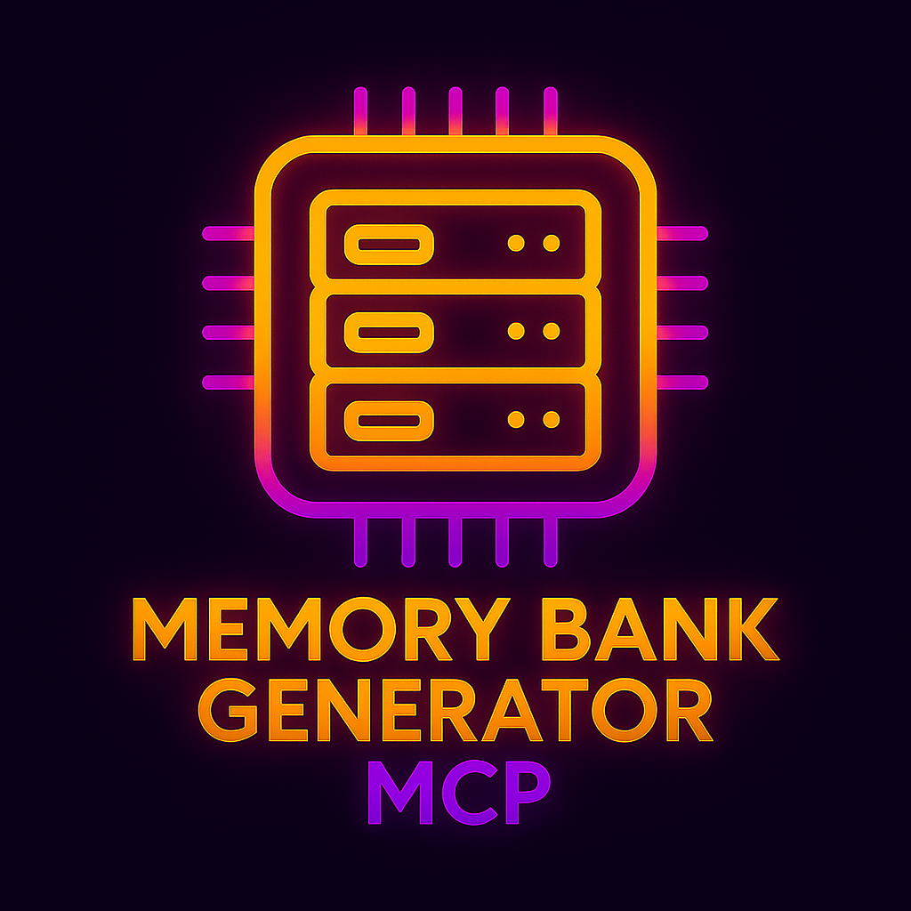

# Memory Bank Generator MCP Server

> 🧠 Professional Memory Bank Generation for AI-Assisted Development
>
> *Comprehensive project documentation that helps AI assistants understand your codebase*
>
> Enterprise-ready MCP server with intelligent project analysis

<div align="center">
  
</div>

A production-ready MCP server that automatically generates comprehensive memory banks with the use of your AI assistant. Analyze any project and create structured documentation that dramatically improves AI understanding and assistance quality.

## 🎯 What It Does

- **Deep Project Analysis**: Advanced scanning of files, dependencies, patterns, and architecture
- **Intelligent Content Generation**: Creates 6 core memory bank files with project-specific content
- **AI Integration Setup**: Automatically configures GitHub Copilot and other AI assistants
- **Quality Validation**: Ensures professional documentation with comprehensive validation
- **Performance Optimized**: Handles projects of any size efficiently (tested up to 500+ files)

## 🚀 Quick Start

### Installation Options

**🌟 Option 1: npm package (Recommended - No local setup required)**

The easiest way to use Memory Bank MCP is via npm. The one-click install buttons above will automatically configure this for you, or you can add it manually to your MCP configuration:

**VS Code MCP Extension:**
```json
{
  "servers": {
    "memory-bank-generator": {
      "command": "npx",
      "args": ["@lgpearson1771/memory-bank-mcp@latest"],
      "type": "stdio"
    }
  }
}
```

**Claude Desktop:**
```json
{
  "mcpServers": {
    "memory-bank-generator": {
      "command": "npx",
      "args": ["@lgpearson1771/memory-bank-mcp@latest"]
    }
  }
}
```

**🛠️ Option 2: Local Development Setup**

For development or customization:

```bash
git clone https://github.com/lgpearson1771/Memory-Bank-MCP.git
cd Memory-Bank-MCP
npm install
npm run build
```

### Setup for VS Code

1. **Quick Install (Recommended):**
   
   Click one of the buttons below to automatically add the npm package configuration to your `mcp.json`:

   **VS Code:** [🚀 Install Server](vscode://ms-vscode.mcp/installServer?config=%7B%22memory-bank-generator%22%3A%7B%22command%22%3A%22npx%22%2C%22args%22%3A%5B%22%40lgpearson1771%2Fmemory-bank-mcp%40latest%22%5D%2C%22type%22%3A%22stdio%22%7D%7D)
   
   **VS Code Insiders:** [🚀 Install Server](vscode-insiders://ms-vscode.mcp/installServer?config=%7B%22memory-bank-generator%22%3A%7B%22command%22%3A%22npx%22%2C%22args%22%3A%5B%22%40lgpearson1771%2Fmemory-bank-mcp%40latest%22%5D%2C%22type%22%3A%22stdio%22%7D%7D)
   
   *These links will automatically install and configure the latest published version from npm.*

   > **Note**: If the install links don't work, you may need to:
   > - Make sure VS Code is installed and set as default for `vscode://` protocol
   > - Try right-clicking the link and selecting "Open link" 
   > - Use the manual configuration below if protocol links are blocked

2. **Manual Configuration (Alternative):**
   
   **Option A: npm package (recommended)**
   ```json
   {
     "servers": {
       "memory-bank-generator": {
         "command": "npx",
         "args": ["@lgpearson1771/memory-bank-mcp@latest"],
         "type": "stdio"
       }
     }
   }
   ```
   
   **Option B: Local installation**
   ```json
   {
     "servers": {
       "memory-bank-generator": {
         "command": "node",
         "args": ["<MCP_SERVER_PATH>\\dist\\index.js"],
         "env": {
           "LOG_LEVEL": "info"
         },
         "type": "stdio"
       }
     }
   }
   ```

### For Claude Desktop

1. **Find Claude Desktop's configuration file:**
   - **Windows**: `%APPDATA%\Claude\claude_desktop_config.json`
   - **macOS**: `~/Library/Application Support/Claude/claude_desktop_config.json`

2. **Add your MCP server configuration:**
   
   **Option A: npm package (recommended)**
   ```json
   {
     "mcpServers": {
       "memory-bank-generator": {
         "command": "npx",
         "args": ["@lgpearson1771/memory-bank-mcp@latest"]
       }
     }
   }
   ```
   
   **Option B: Local installation**
   ```json
   {
     "mcpServers": {
       "memory-bank-generator": {
         "command": "node",
         "args": ["<MCP_SERVER_PATH>\\dist\\index.js"],
         "env": {
           "LOG_LEVEL": "info"
         }
       }
     }
   }
   ```

3. **Restart Claude Desktop** - Your 6 MCP tools will be available!

### Verify Installation

**Run Unit Tests:**
```bash
node tests/unit/validate-tools.js
```

**Run Integration Tests:**
```bash
node tests/integration/run-all.mjs
```

**Quick Tool Test:**
```bash
node tests/integration/quick-test.js
```

You should see: ✅ All tests passed! MCP tools are working correctly.

## � Documentation

**📁 [Complete Documentation](docs/)** - All guides, setup instructions, and technical details

**Quick Links:**
- **[Setup Guide](docs/MCP_INTEGRATION_GUIDE.md)** - Installation for Claude Desktop and VS Code
- **[Configuration Examples](docs/examples/)** - Ready-to-use config files
- **[Architecture & Testing](docs/)** - Technical documentation and testing strategy

## �🛠️ Available Tools

**5 MCP Tools for Memory Bank Management:**

- `generate_memory_bank` - Creates comprehensive memory banks with full project analysis
- `analyze_project_structure` - Deep analysis of project structure, dependencies, and patterns
- `update_memory_bank` - Updates existing memory banks with current project state
- `validate_memory_bank` - Validates memory bank completeness and AI integration
- `setup_copilot_instructions` - Configures AI assistants to use your memory bank

## 📁 What Gets Created

Memory banks are created in `.github/memory-bank/` with these files:

```
.github/
├── memory-bank/
│   ├── projectbrief.md          # Project overview
│   ├── productContext.md        # Goals and purpose  
│   ├── activeContext.md         # Current work
│   ├── systemPatterns.md        # Architecture
│   ├── techContext.md           # Tech stack
│   └── progress.md              # Status
└── copilot-instructions.md      # Copilot config
```

**Optional**: You can request additional files organized in semantic folders like `features/`, `api/`, `deployment/`, etc.

## 🎯 How It Works

### Intelligent Analysis & Generation

**Professional Workflow**
```
You: "Generate a memory bank for my project at C:\MyProject"
MCP: Deep Analysis → Content Generation → Memory Bank Creation → AI Integration
```

**Advanced Processing**
- **Project Intelligence**: Analyzes dependencies, architecture, patterns, and business context
- **Professional Content**: Generates enterprise-grade documentation with project-specific details
- **Smart Organization**: Creates structured memory banks with comprehensive file organization
- **Automatic Integration**: Sets up AI assistants with proper memory bank references
- **Quality Assurance**: Validates content quality and completeness

**Result**: 6 professional memory bank files with detailed project analysis, not generic templates.

## 💡 Why Use This?

- **Enterprise Quality**: Professional documentation suitable for production environments
- **Deep Understanding**: AI assistants gain comprehensive knowledge of your project
- **Zero Manual Work**: Fully automated generation and AI integration
- **Performance Tested**: Handles large projects efficiently (500+ files in <1 second)
- **Production Ready**: Comprehensive test coverage with 23 integration tests
- **Universal Compatibility**: Works with Claude Desktop, VS Code, and all MCP-compatible tools

## 🤝 Contributing

This project started at the 2025 Microsoft Hackathon and is now production-ready!

```bash
git clone https://github.com/lgpearson1771/Memory-Bank-MCP.git
cd Memory-Bank-MCP
npm install
npm run dev
```

## � More Info

- [Cline Memory Bank Documentation](https://docs.cline.bot/prompting/cline-memory-bank)
- [Model Context Protocol](https://modelcontextprotocol.io/)
- [GitHub Copilot Docs](https://docs.github.com/en/copilot)

---

*Made with ❤️ for developers who want smarter AI assistants*