# Memory Bank Generator MCP Server

> 🧠 Intelligent Memory Bank Generation for AI-Assisted Development
>
> *2025 Microsoft Hackathon Project - Luke Pearson*

An intelligent MCP server that automatically generates, maintains, and evolves comprehensive memory bank files for any software project, enabling AI assistants to have persistent, structured knowledge about codebases.

## 🚀 Vision

Transform how AI assistants understand and work with software projects by automatically creating rich, contextual memory banks that capture project essence, patterns, and evolution over time.

## ✨ Key Features

### 🔍 **Intelligent Project Analysis**

- Automated codebase scanning and pattern detection
- Multi-language support (JavaScript/TypeScript, Python, Java, C#, Go)
- Dependency analysis and architecture mapping
- Git history mining for project evolution insights

### 📝 **Comprehensive Memory Bank Generation**

- **Project Context**: Purpose, goals, and solution overview
- **Technical Context**: Technology stack, architecture, and dependencies
- **Active Context**: Current development focus and recent changes
- **System Patterns**: Code patterns, best practices, and communication flows
- **Progress Tracking**: Development timeline, feature status, and roadmap

### 🔄 **Continuous Evolution**

- Real-time change detection and memory bank updates
- Intelligent merging of new information
- Version tracking of memory bank evolution
- Conflict resolution for competing information

### 🔗 **Multi-Source Intelligence**

- Code analysis via AST parsing
- Git commit history analysis
- Documentation extraction (README, comments, docs)
- Integration with other MCP servers (GitHub, Azure DevOps)
- Project metadata mining (package.json, requirements.txt, etc.)

## 🎯 Value Proposition

### For Developers

- **Zero-effort Documentation**: Automatic generation and maintenance
- **Knowledge Preservation**: Capture tribal knowledge and decisions
- **Onboarding Acceleration**: New team members get instant project context

### For AI Assistants

- **Rich Context**: Deep understanding of project structure and patterns
- **Persistent Memory**: Retain knowledge across conversations
- **Better Assistance**: More accurate and contextually relevant help

### For Teams

- **Shared Knowledge Base**: Consistent understanding across team members
- **Living Documentation**: Evolves automatically with the codebase
- **Decision History**: Track architectural decisions and their rationale

## 🛠 How It Works

```mermaid
flowchart LR
    Project[Your Project] --> Analyze[🔍 Analysis Engine]
    Analyze --> Extract[📊 Context Extraction]
    Extract --> Generate[🧠 Memory Bank Generation]
    Generate --> Memory[📝 Structured Memory Banks]
    Memory --> AI[🤖 AI Assistant]
    
    style Project fill:#f9f,stroke:#333,stroke-width:2px
    style Memory fill:#bfb,stroke:#333,stroke-width:2px
    style AI fill:#bbf,stroke:#333,stroke-width:2px
```



## 🚀 Quick Start

### Installation

```bash
# Clone the repository
git clone https://github.com/lgpearson1771/Memory-Bank-MCP.git
cd Memory-Bank-MCP

# Install dependencies
npm install

# Build the project
npm run build
```

### Basic Usage

```bash
# Generate memory bank for a project
npm run generate -- --project /path/to/your/project

# Watch for changes and auto-update
npm run watch -- --project /path/to/your/project

# Generate with specific template
npm run generate -- --project /path/to/your/project --template typescript
```

### MCP Integration

```json
{
  "mcpServers": {
    "memory-bank-generator": {
      "command": "node",
      "args": ["./dist/index.js"],
      "env": {
        "MEMORY_BANK_PATH": "./memory-banks"
      }
    }
  }
}
```

## 🧪 Example Output

For a typical TypeScript project, the generator creates:

```text
memory-bank/
├── projectContext.md     # "A React dashboard for project analytics..."
├── techContext.md        # "Built with React 18, TypeScript 5.x, Vite..."
├── activeContext.md      # "Currently implementing user authentication..."
├── systemPatterns.md     # "Uses custom hooks pattern, REST API calls..."
└── progress.md          # "✅ Core dashboard ⏳ Authentication 📋 Reports..."
```

## 🔧 MCP Tools

The server provides these MCP tools for AI assistants:

- `analyze_project` - Deep project structure and pattern analysis
- `generate_memory_bank` - Create comprehensive memory bank files
- `update_memory_bank` - Incremental updates based on changes
- `extract_from_source` - Pull context from Git, GitHub, Azure DevOps
- `categorize_information` - Organize information into memory categories
- `validate_memory_bank` - Ensure quality and completeness

## 🏗 Architecture

Built on proven patterns from successful MCP servers:

```typescript
src/
├── operations/          # Core analysis and generation operations
│   ├── analysis.ts     # Project structure analysis
│   ├── extraction.ts   # Multi-source context extraction
│   ├── generation.ts   # Memory bank generation engine
│   └── integration.ts  # External MCP server integration
├── common/             # Shared utilities and error handling
├── types/              # TypeScript type definitions
└── server.ts          # MCP server implementation
```

## 🌟 Advanced Features

### Template System

- Pre-built templates for common project types
- Customizable memory bank structures
- Organization-specific templates

### Integration Hub

- Connect with GitHub MCP Server for repository data
- Azure DevOps MCP Server integration for work items
- Extensible plugin system for custom sources

### Team Collaboration

- Shared memory bank repositories
- Conflict resolution for team edits
- Access control and permissions

## 📊 Success Metrics

- **Generation Accuracy**: High-quality, relevant memory banks
- **Time Savings**: 80%+ reduction in documentation time
- **AI Improvement**: Better AI assistant responses with context
- **Adoption Rate**: Growing community of users and contributors

## 🗺 Roadmap

### Phase 1: Core Foundation (Current)

- ✅ Basic memory bank generation for TypeScript projects
- ✅ File watching and incremental updates
- ✅ GitHub integration
- ✅ Command-line interface

### Phase 2: Enhanced Intelligence

- 🔄 Advanced pattern detection
- 🔄 Multi-language support expansion
- 🔄 Azure DevOps integration
- 🔄 Web dashboard

### Phase 3: Enterprise Features

- 📋 Team collaboration tools
- 📋 Enterprise security controls
- 📋 Analytics and reporting
- 📋 Custom integration framework

## 🤝 Contributing

We welcome contributions! This project is part of the 2025 Microsoft Hackathon and aims to demonstrate the power of automated knowledge capture.

### Development Setup

```bash
git clone https://github.com/lgpearson1771/Memory-Bank-MCP.git
cd Memory-Bank-MCP
npm install
npm run dev
```

### Testing

```bash
npm test                 # Unit tests
npm run test:integration # Integration tests
npm run test:security   # Security tests
```

## 📄 License

MIT License - see [LICENSE](LICENSE) for details

## 🙏 Acknowledgments

- Built on the foundation of successful MCP server patterns
- Inspired by the Azure DevOps MCP Server architecture
- Part of the 2025 Microsoft Hackathon innovation initiative

---

> **🎯 Hackathon Goal**: Demonstrate how AI can automatically capture and maintain project knowledge, making software development more intelligent and collaborative.

*Made with ❤️ for the developer community*
